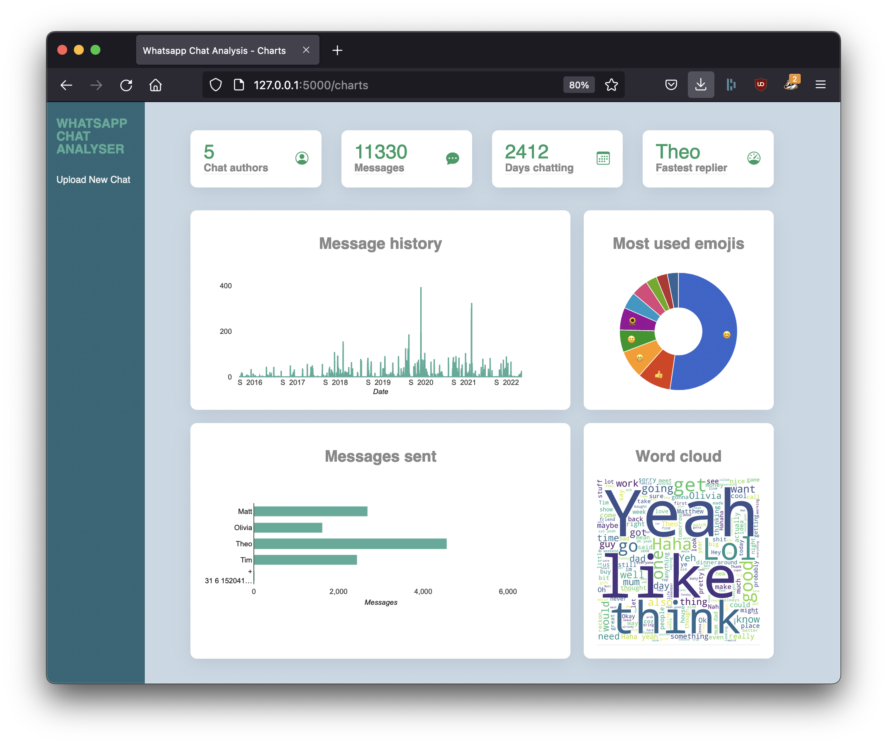
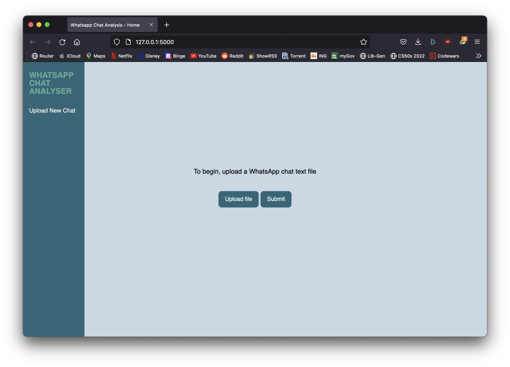
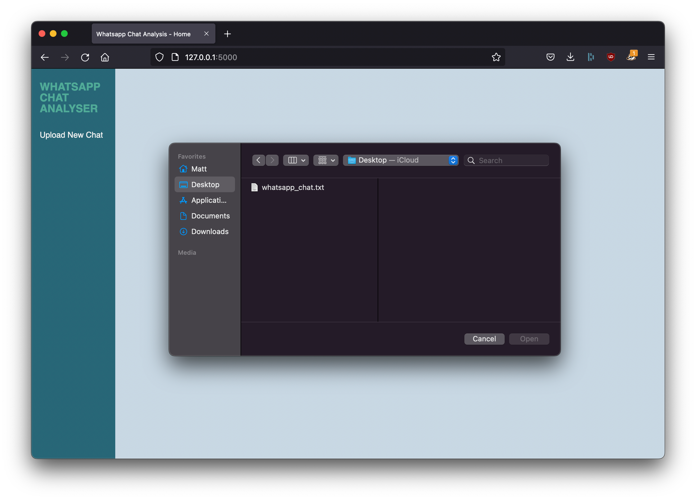

<div id="top"></div>


<!-- PROJECT LOGO -->
<br />
<div align="center">
  <h3 align="center">WHATSAPP CHAT ANALYSER</h3>
  <p align="center">
    A simple web app dashboard for analysing Whatsapp messages.
    <br />
    <br />
    <a href="https://youtu.be/brCRmVkVp5Q">View Demo</a>
  </p>
</div>

<!-- ABOUT THE PROJECT -->
## About The Project




The Whatsapp Chat Analyser is a web app written in Python, Javascript and SQLite3 that can upload and parse a Whatsapp archine file in .txt format and create a dashboard of message data including graphs, a wordcloud, pie charts and text-based information.

<p align="right">(<a href="#top">back to top</a>)</p>


### Built With

* [Python](https://www.python.org/)
* [Flask](https://flask.palletsprojects.com/en/2.1.x/)
* [Jinja2](https://palletsprojects.com/p/jinja/)
* [SQLite3](https://www.sqlite.org/index.html)
* Javascript/HTML
* [Datetime module](https://docs.python.org/3/library/datetime.html)
* [os Module](https://docs.python.org/3/library/os.html)
* [Collections Module](https://docs.python.org/3/library/collections.html)
* [Regex Module (not re module)](https://pypi.org/project/regex/)
* [Emoji Module](https://pypi.org/project/emoji/)
* [Pandas Module](https://pandas.pydata.org/)
* [Wordcloud Module](https://github.com/amueller/word_cloud)
* [Google Charts](https://developers.google.com/chart)

<p align="right">(<a href="#top">back to top</a>)</p>


<!-- GETTING STARTED -->
## Getting Started

First you need to have a Whatsapp archive file to use. The mobile version of the app has a feature to download an archive of a chat as a .txt file. Save that file so it can be uploaded to the Whatsapp Chat Analyser.

### Prerequisites

The web app includes some external libraries. Download them using pip (you must have pip>=19.3 to install from PyPI):
* Regex
  ```sh
  pip install regex
  ```
* Emoji
  ```sh
  pip install emoji
  ```
* Pandas
  ```sh
  pip install pandas
  ```
* Wordcloud
  ```sh
  pip install wordcloud
  ```


<!-- USAGE EXAMPLES -->
## Usage



To begin, click on the 'Upload file' button and locate the Whatsapp chat archive .txt file, then click the 'Submit' button.



The app will then spend a few seconds analysing the data before revealing the dashboard:


The dashboard also has data that is revealed when you hover over the cards, including the top 4 quick info cards.

The charts and graphs are interactive and reveal additional information when you mouse over them.

You can click on the 'Upload New Chat' link on the left to go back to the start page. This will also delete all the uploaded files and delete the SQL database, as well as deleting the wordcloud image.

<p align="right">(<a href="#top">back to top</a>)</p>


<!-- ACKNOWLEDGMENTS -->
## Acknowledgments

A major source of inspiration for the regular expressions used in the project comes from Mazin Ahmed - https://github.com/mazen160/whatsapp-chat-parser

I used Google Charts for a number of the visualisations: https://developers.google.com/chart

This project was made on the lands of the Wurundjeri people of the Kulin Nation. We pay our respects to their Elders, past and present. Sovereignty was never ceded.

<p align="right">(<a href="#top">back to top</a>)</p>
